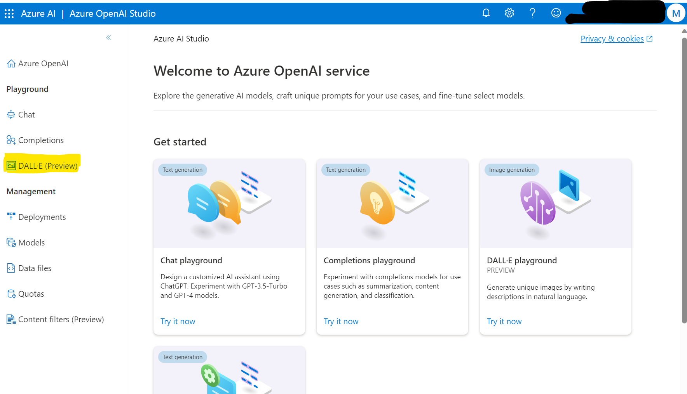
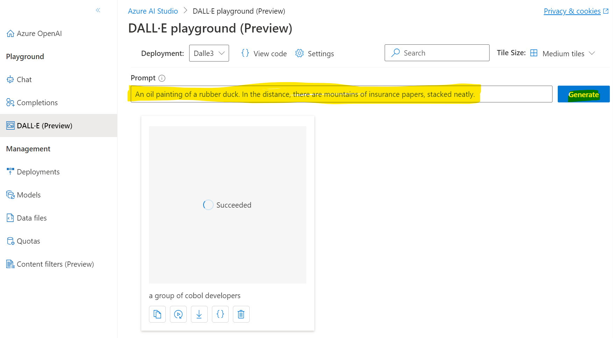
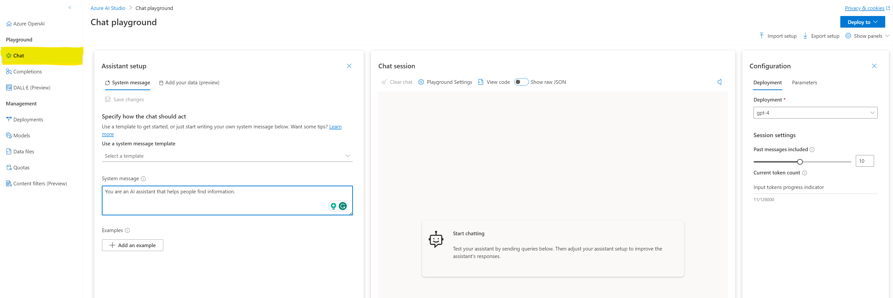
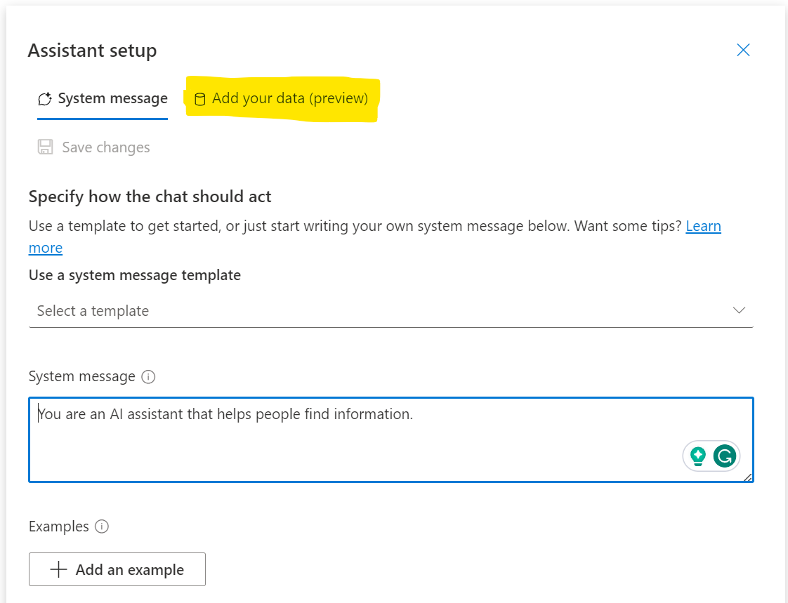
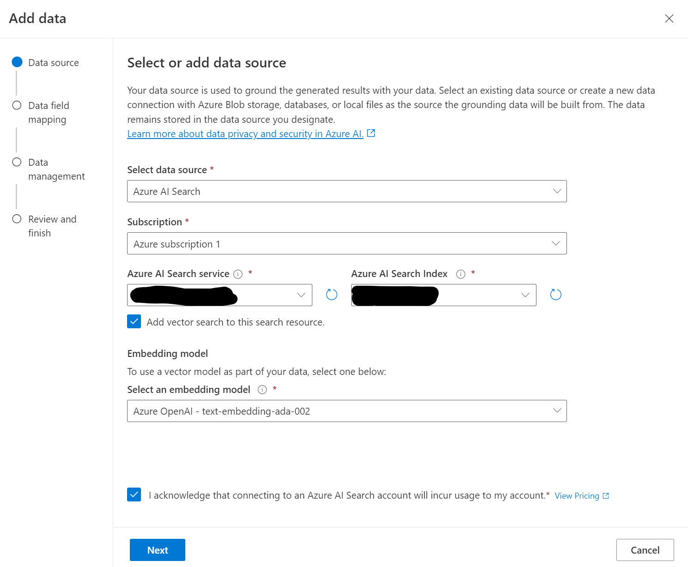
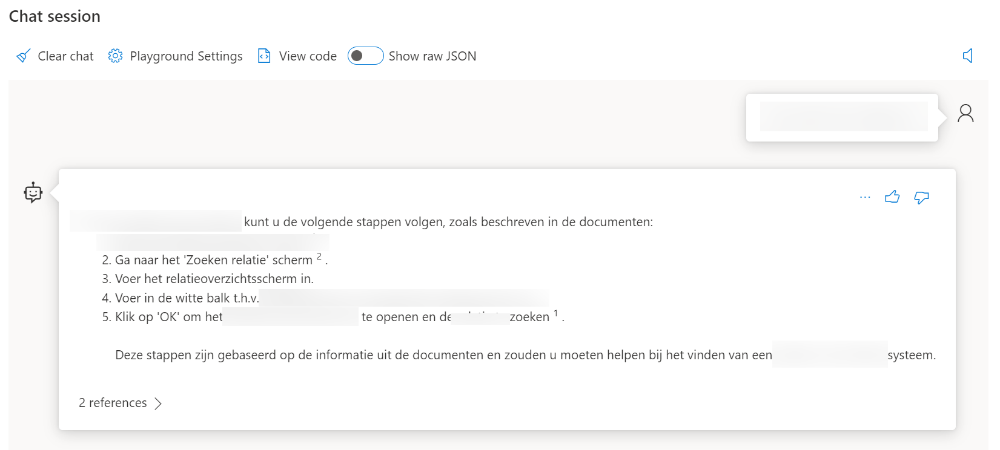

# Azure OpenAI Studio

In Azure OpenAI Studio, you can create and manage OpenAI resources, and use them to build and deploy models. It's also a perfect place to play around with various models! On this page you'll find two tutorials that will help you get started with OpenAI Studio.

## Creating Pictures with DALL-E

1. Go to Azure OpenAI Studio. The link will be provided to you on the day of the hackathon. There are two Studios, you will need to one located in Sweden. Click on *DALL-E*.

2. Enter a prompt in the prompt box and hit "generate". Be creative!

3. Enjoy the fruits of your labor!

## Chatting with an LLM and include your data

This is exciting, while all the developers are busy typing away, we get to skip the queue and get results right away! 

1. Go to Azure OpenAI Studio. The link will be provided to you on the day of the hackathon. There are two Studios, you will need to one located in UK South. Click on *Chat* under Playground.

2. In this tutorial, we want to use Azure Search to bring in some documents. We will not be bothering with a system prompt. If you're not looking to bring in documents, feel free to read [more][1] about prompt engineering techniques! We will add our data bly clicking on the following tab:

3. Click on Add Data Source and select Azure Search. You need to select an index. Every index occurs twice in the list, you need to select the one that *does not end with -index*. If you're not sure, ask one of the Xebia | Xpirit consultants.

4. Hit Next, change nothing. Hit Next again and enable Vector search. Hit Next and finish! Now, you can start chatting in the screen on the right, and see what the LLM has to say!

[1]: https://learn.microsoft.com/en-us/azure/ai-services/openai/concepts/advanced-prompt-engineering?pivots=programming-language-chat-completions
